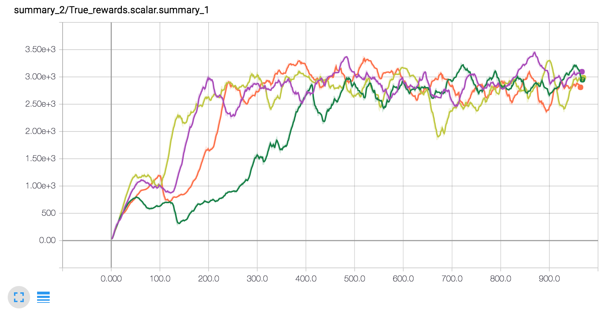
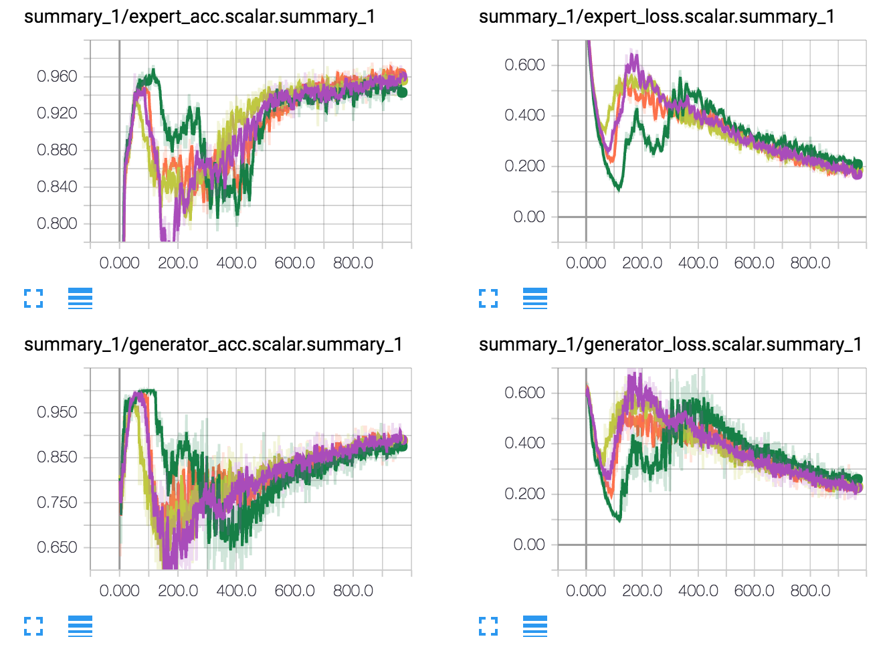
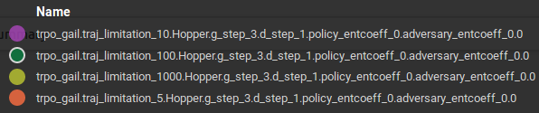
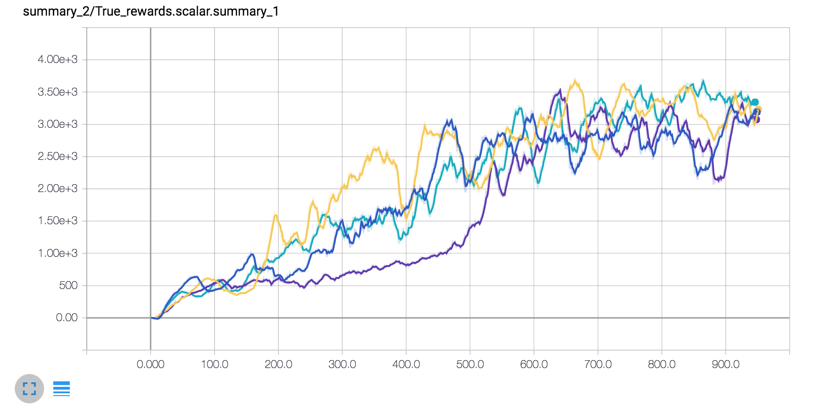
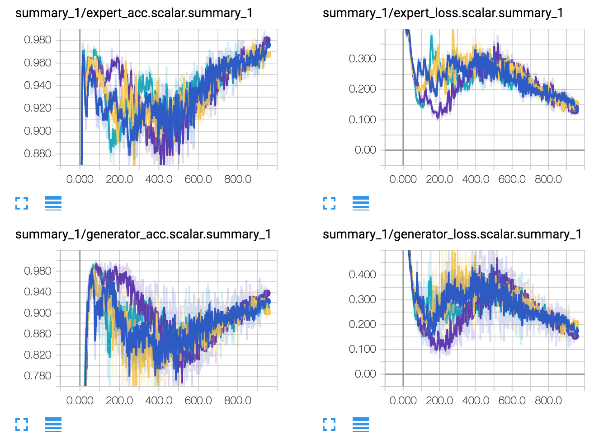
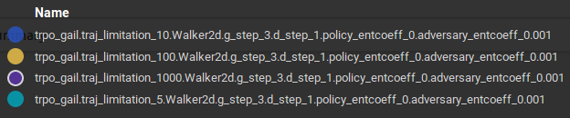
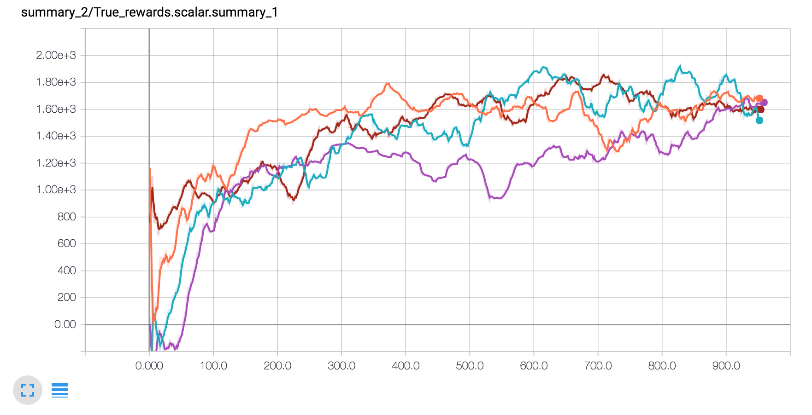
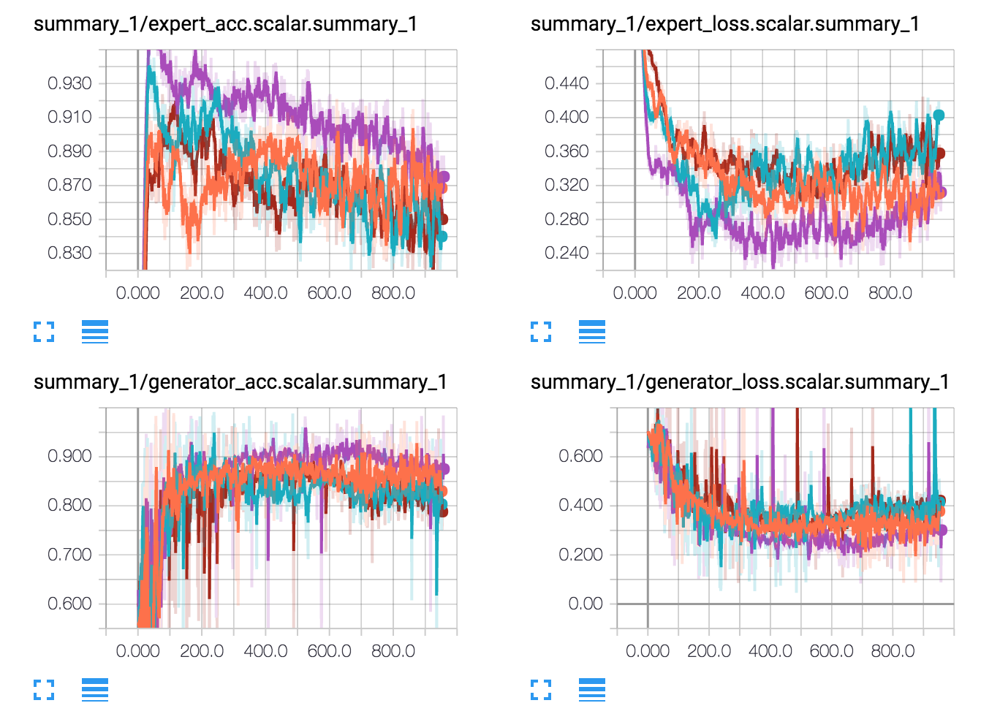
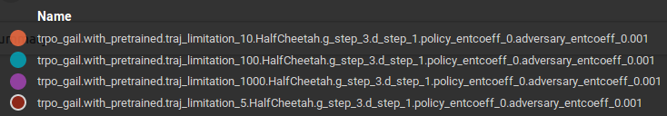

# Experiments for GAIL

## Hopper-v1

The total return (environment rewards, only used for evaluation):

The episode length and reward from discriminator:

.png)

The loss and accuracy of the discriminator:

Legend:

## Walker2d-v1

The total return (environment rewards, only used for evaluation):

The episode length and reward from discriminator:

.png)

The loss and accuracy of the discriminator:

Legend:

## HalfCheetah-v1

The total return (environment rewards, only used for evaluation):

The episode length and reward from discriminator:

.png)

The loss and accuracy of the discriminator:

Legend:

